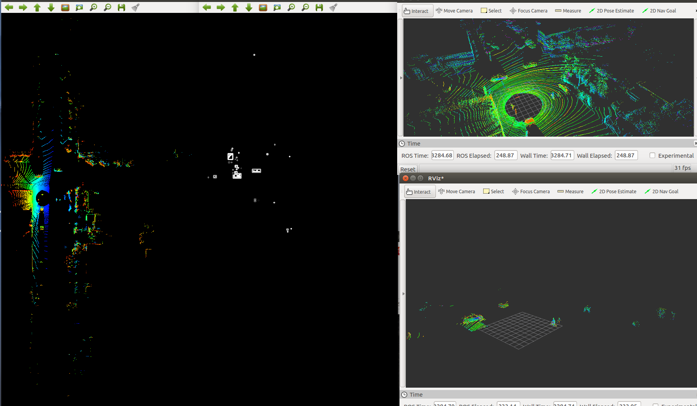

# Feb. 20 GMM+pcl/filter




# 1 标记ROI

```cpp
 Mat threshold_output;
        vector<vector<Point> > contours;
        vector<Vec4i> hierarchy;

        /// 使用Threshold检测边缘
        threshold(src_gray, threshold_output, thresh, 255, THRESH_BINARY);
        /// 找到轮廓
        findContours(threshold_output, contours, hierarchy, CV_RETR_TREE, CV_CHAIN_APPROX_SIMPLE, Point(0, 0));

        /// 多边形逼近轮廓 + 获取矩形和圆形边界框
       // vector<vector<Point> > contours_poly(contours.size());
        vector<Rect> boundRect(contours.size());
        vector<Point2f>center(contours.size());
        vector<float>radius(contours.size());

        //for (int i = 0; i < contours.size(); i++)
        //{
        //	approxPolyDP(Mat(contours[i]), contours_poly[i], 3, true);
        //	boundRect[i] = boundingRect(Mat(contours_poly[i]));
        //	minEnclosingCircle(contours_poly[i], center[i], radius[i]);
        //}
        int index = 0;
        for (int i = 0; i < contours.size(); i++)
        {

                boundRect[i] = boundingRect(Mat(contours[i]));
           // approxPolyDP(Mat(contours[i]), contours_poly[i], 3, true);

           // minEnclosingCircle(contours[i], center[i], radius[i]);
        }

        Mat drawing = Mat::zeros(threshold_output.size(), CV_8UC3);
    pcl::PointCloud<pcl::PointXYZI>::Ptr out_(new pcl::PointCloud<pcl::PointXYZI>);
        for (int i = 0; i< contours.size(); i++)
        {
            Scalar color = Scalar(rng.uniform(0, 255), rng.uniform(0, 255), rng.uniform(0, 255));
          //  drawContours(drawing, contours_poly, i, color, 1, 8, vector<Vec4i>(), 0, Point());
            rectangle(src_gray, boundRect[i].tl(), boundRect[i].br(), color, 2, 8, 0);
            //circle(drawing, center[i], (int)radius[i], color, 2, 8, 0);
            for(size_t j=0; j< pc->size();j++)
            {

                if((pc->points[j].x>((double)(boundRect[i].y-3)*RESO_2D)+offset_x)
                    &&(pc->points[j].x<((double)(boundRect[i].y+3+boundRect[i].width)*RESO_2D+offset_x))
                      &&(pc->points[j].y<((double)(boundRect[i].x+3+boundRect[i].height)*RESO_2D+offset_y))
                        &&(pc->points[j].y>((double)(boundRect[i].x-3)*RESO_2D)+offset_y) )
                {
                    out_->push_back(pc->points[j]);
                }
            }
        }
        oout = out_;
```


# 2 3D恢复

```cpp
    pcl::PointCloud<pcl::PointXYZI>::Ptr out_(new pcl::PointCloud<pcl::PointXYZI>);
        for (int i = 0; i< contours.size(); i++)
        {
            Scalar color = Scalar(rng.uniform(0, 255), rng.uniform(0, 255), rng.uniform(0, 255));
          //  drawContours(drawing, contours_poly, i, color, 1, 8, vector<Vec4i>(), 0, Point());
            rectangle(src_gray, boundRect[i].tl(), boundRect[i].br(), color, 2, 8, 0);
            //circle(drawing, center[i], (int)radius[i], color, 2, 8, 0);
            for(size_t j=0; j< pc->size();j++)
            {

                if((pc->points[j].x>((double)(boundRect[i].y-3)*RESO_2D)+offset_x)
                    &&(pc->points[j].x<((double)(boundRect[i].y+3+boundRect[i].width)*RESO_2D+offset_x))
                      &&(pc->points[j].y<((double)(boundRect[i].x+3+boundRect[i].height)*RESO_2D+offset_y))
                        &&(pc->points[j].y>((double)(boundRect[i].x-3)*RESO_2D)+offset_y) )
                {
                    out_->push_back(pc->points[j]);
                }
            }
        }
        oout = out_;
```

