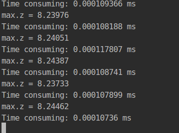
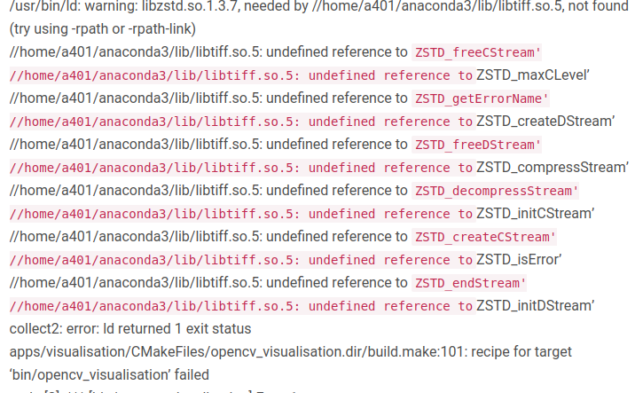
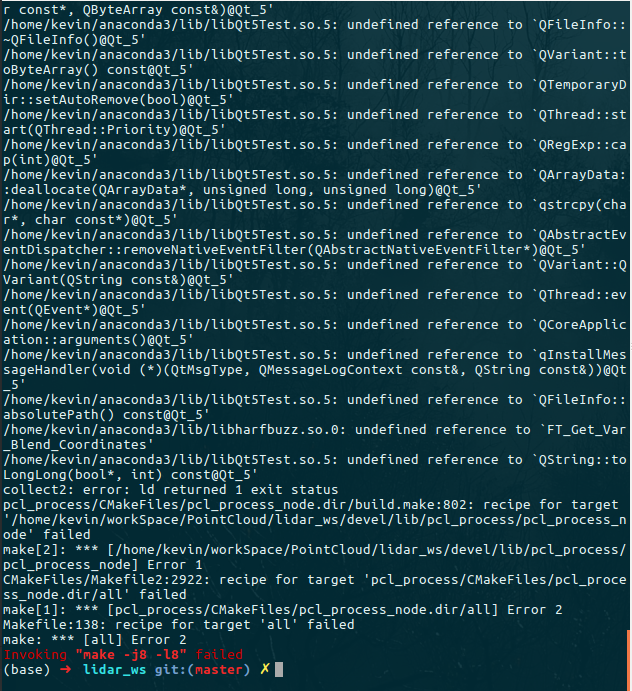

# Birdseye 从三维到二维


# 1获取点云尺寸

```cpp
#include <pcl/common/common.h>    
	pcl::PointCloud<pcl::PointXYZ>::Ptr cloud (new pcl::PointCloud<pcl::PointXYZ>);
 
    cloud->width  = pc->points.size();
    cloud->height = 1;
    cloud->points.resize(cloud->width * cloud->height);

	pcl::PointXYZ min;//用于存放三个轴的最小值
    pcl::PointXYZ max;//用于存放三个轴的最大值
    pcl::getMinMax3D(*cloud,min,max);
```

注意, 这里2个小坑,

* 要使用这个函数必须包含头文件`#include <pcl/common/common.h>`
* 创建点云new了一个指针, 之后要立刻对点云进行初始化尺寸,否则会发生内存错误

```cpp
void point_cloud_2_birdseye(pcl::PointCloud<pcl::PointXYZI>::Ptr & pc, cv::Mat & out){
    clock_t start,end;
    start = clock();
    //需要测试运行时间的程序段
    pcl::PointCloud<pcl::PointXYZ>::Ptr cloud (new pcl::PointCloud<pcl::PointXYZ>);
    cloud->width  = pc->points.size();
    cloud->height = 1;
    cloud->points.resize(cloud->width * cloud->height);

    for(size_t i = 0; i < pc->points.size(); i++){
        cloud->points[i].x = pc->points[i].x;
        cloud->points[i].y = pc->points[i].y;
        cloud->points[i].z = pc->points[i].z;
    }
    pcl::PointXYZ min;//用于存放三个轴的最小值
    pcl::PointXYZ max;//用于存放三个轴的最大值
    pcl::getMinMax3D(*cloud,min,max);

    cout<<"max.z = "<<max.z<<"\n"<<endl;
    end = clock();
    cout<<"Time consuming: "<<(double)(end-start)/CLOCKS_PER_SEC/1000<<" ms"<<endl;
}

```

**运行结果**



可以看出这个底层基于eigen的算法基本不消耗时间

# 2 创建对应opencv图像


```cpp
#include <opencv2/opencv.hpp>
#include <opencv2/core/core.hpp>
#include <opecv2/highgui/highgui.hpp>
/*
	创建图像并初始化为0
*/
Mat out(map_width,map_height,CV_8UC1,Scalar(0));

```

注意, 这里有几个大坑

* Anaconda 报错一大堆, 类似如下

  

  这时候只需要删除掉环境变量里的conda就行了.

  

  

* 创建矩阵一定要清零

* 矩阵减法一定要维数相同, 否则出大问题.

* imshow不显示, 加一个`waitKey(1)`, 注意 0 不行.


# 3 灰度图像彩色化

[参考博文](https://www.cnblogs.com/aiguona/p/9936638.html)

```cpp
Mat gray2rainbow(const Mat& scaledGray)
{
    Mat outputRainbow(scaledGray.size(), CV_8UC3);
    unsigned char grayValue;
    for (int y = 0; y < scaledGray.rows; y++)
        for (int x = 0; x < scaledGray.cols; x++)
        {
            grayValue = scaledGray.at<uchar>(y, x);
            Vec3b& pixel = outputRainbow.at<Vec3b>(y, x);
            if(grayValue == 0)
            {
                pixel[0] = 0;
                pixel[1] = 0;
                pixel[2] = 0;
            }
            else if (grayValue <= 51)
            {
                pixel[0] = 255;
                pixel[1] = grayValue * 5;
                pixel[2] = 0;
            }
            else if (grayValue <= 102)
            {
                grayValue -= 51;
                pixel[0] = 255 - grayValue * 5;
                pixel[1] = 255;
                pixel[2] = 0;
            }
            else if (grayValue <= 153)
            {
                grayValue -= 102;
                pixel[0] = 0;
                pixel[1] = 255;
                pixel[2] = grayValue * 5;
            }
            else if (grayValue <= 204)
            {
                grayValue -= 153;
                pixel[0] = 0;
                pixel[1] = 255 - static_cast<unsigned char>(grayValue * 128.0 / 51 + 0.5);
                pixel[2] = 255;
            }
            else if (grayValue <= 255)
            {
                grayValue -= 204;
                pixel[0] = 0;
                pixel[1] = 127 - static_cast<unsigned char>(grayValue * 127.0 / 51 + 0.5);
                pixel[2] = 255;
            }
        }

    return outputRainbow;
}
```

# 4 一次差分求变化

```cpp
// 创建全局常亮
int map_width,map_height,offset_x,offset_y;
// 创建缓存矩阵
Mat last,diff;
void point_cloud_2_birdseye(pcl::PointCloud<pcl::PointXYZI>::Ptr & pc, cv::Mat & out2){
    clock_t start,end;
    start = clock();
    //需要测试运行时间的程序段
    pcl::PointCloud<pcl::PointXYZ>::Ptr cloud (new pcl::PointCloud<pcl::PointXYZ>);
    cloud->width  = pc->points.size();
    cloud->height = 1;
    cloud->points.resize(cloud->width * cloud->height);

    for(size_t i = 0; i < pc->points.size(); i++){
        cloud->points[i].x = pc->points[i].x;
        cloud->points[i].y = pc->points[i].y;
        cloud->points[i].z = pc->points[i].z;
    }
    pcl::PointXYZ min;//用于存放三个轴的最小值
    pcl::PointXYZ max;//用于存放三个轴的最大值
    pcl::getMinMax3D(*cloud,min,max);
    static int flag1 = 0;

    if(flag1 == 0){
        // 读取图片合理尺寸
        map_width  = (int)((max.x - min.x)/RESO)+50;
        map_height = (int)((max.y - min.y)/RESO)+50;
        // 创建尺寸变量
        Size dsize = Size(map_height,map_width);
        // 更新缓存图片尺寸
        last.create(dsize,CV_8UC1);
        diff.create(dsize,CV_8UC1);
        // 更新点云平面到像素平面的偏置
        offset_x = min.x;
        offset_y = min.y;
        //保证只执行一次
        flag1=1;
    }

    int z_scale = (int)((max.z-min.z));
    // 创建输出矩阵并清零.
    Mat out(map_width,map_height,CV_8UC1,Scalar(0));

	// 遍历点云并赋值到矩阵
    for(size_t i = 0; i < pc->points.size(); i++){
        size_t Y =(int)((cloud->points[i].y - offset_y)/(RESO));
        size_t X =(int)((cloud->points[i].x - offset_x)/(RESO));
        uchar Z = (uchar)((cloud->points[i].z - min.z)/(z_scale) *255);
        uchar * inData = out.ptr<uchar>(X);
        inData[Y] = Z;
    }
	// 进行矩阵减法
    absdiff(out,last,diff);
    // 更新矩阵
    last = out;
    // 灰度图像彩色化
    Mat color(map_width,map_height,CV_8UC3,Scalar(0));
    color = gray2rainbow(diff);
    
    cv::imshow("bird", color);
    waitKey(1);
    end = clock();
    // 计算运行时间
    cout<<"Time consuming: "<<(double)(end-start)/CLOCKS_PER_SEC/1000<<" ms"<<endl;
}

```

