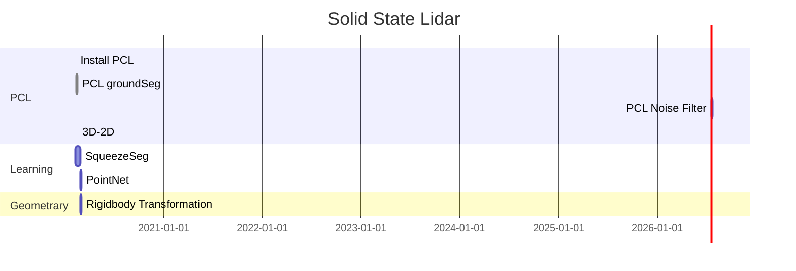
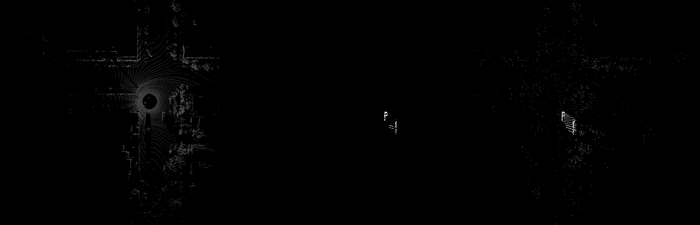
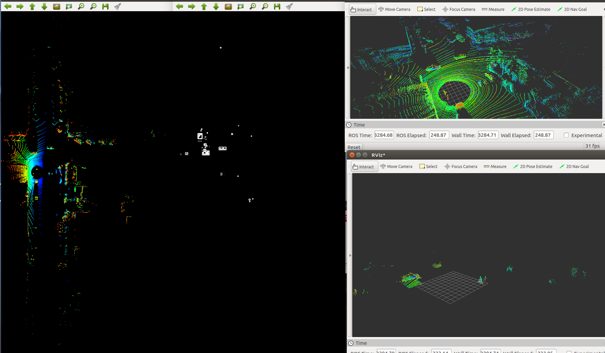

# SS Lidar

> Solid State Lidar
>
> Our goal is to design a high efficiency algorithm to label the position of things in the 3D world. First we need to cluster/recognized all things. Then we are going to use geometry method to locate specific things in the real world.
>
> 
>
> by Yunfan REN
>
> renyunfan@berkeley.edu

# 0 Idea

## How to recognize object

### 1 RGB-D

Use RGB image and CNN to segment objects, and then use geometry methods to find the associate location of specific object.

### 2 3D learning method

Use 3D cnn to segment objects directly and get the depth data. Use basic geometry method to get the location.

## Make the most of static scenes

### 1 Filter of the ground

[基于几何特征的地面点云分割](https://zhuanlan.zhihu.com/p/34815976)

### 2 Static object filtering

It takes more time to initialize the scene, semantically segment the scene in advance, and then divide and conquer the problem of target recognition.

# 1 Process

## Feb

### 11 SqueezeSeg

* Get the date.
* Try some learing method to segment the car from the point cloud image.

Modified and reproduced the image segmentation algorithm in SqueezeSeg, using existing models to segment the point cloud image.

### 14 Ground filter

[Notes](./Notes/Feb_14_Voxel_Grid_Filter.md)

    
     
    
From left to right: Ground, Original, No-ground-Seg

### 15  Voxel Grid Filter

    
     
    
Voexl seg (1,1,1)

**Idea**

### 17 3D to 2D

[Notes of 3D to 2D](./Notes/Feb_17_Birdseye.md)

### 18 GMM background seg

[Feb_18_Gaussian Mixed Model.md](./Notes/Feb_18_Gaussian Mixed Model.md)

    
     
    
From left to right: Original, GMM+Medium Filter, Only GMM

## 20 GMM+pcl/filter 

[Notes](./Notes/Feb_20_GMM_pclfilter.md)

# 2 To Do List

* Learn the octree
* Learn to use PCL and basic point cloud operation
* Learn some point cloud cluster algorithm.

# 3 Question

# 4 Resources

[Out kernel octree](https://zhuanlan.zhihu.com/p/103701375)

[ROS & PCL](https://zhuanlan.zhihu.com/p/103700110)

[Segmentation in PCL](https://zhuanlan.zhihu.com/p/103700893)